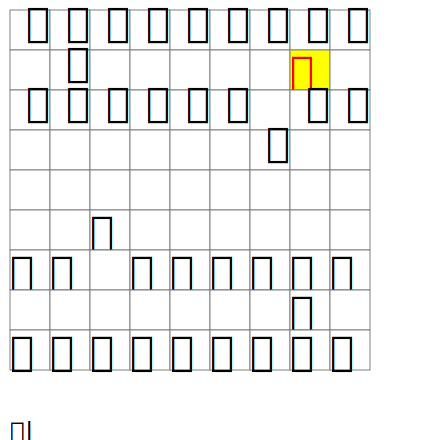

# shogi-tools

A tool to write shogi-board `.svg` file from `.kif` file.

https://user-images.githubusercontent.com/45124565/195773264-a09c5335-eae0-4720-bdbe-7f5c0ece6a48.mp4


```python
board = Board(grid=initialize_grid())
moves = [
    parse_move("７六歩(77)"),
    parse_move("３四歩(33)"),
    parse_move("２二角成(88)"),
]
for move in moves:
    board.process_move(move)
with open("board.svg", "w") as f:
    write_svg(f, board)
subprocess.run(["eog", "board.svg"])
```



## run

```sh
poetry run python kif_parser.py -f <kif_file>
```


## run tests

```sh
poetry run pytest
```

## generate mp4

```sh
poetry run python sfen2svg.py
./convert.sh
./png2mp4.sh
```
